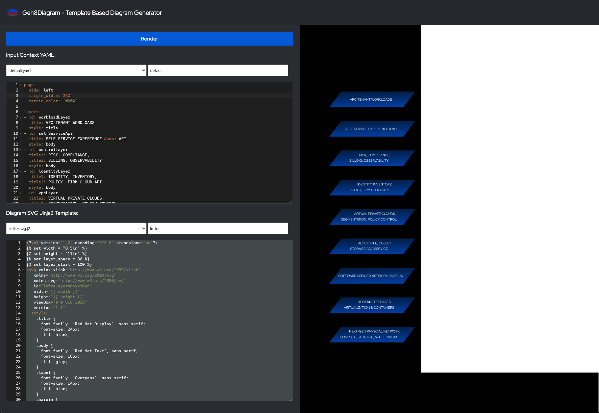

# Gen8Diagram - Template Based Diagram Generator

Generate diagrams using YAML based data inputs applied to an SVG Jinga2 template. 
Interactively edit the data inputs and the template. 

This is a quick utility. Each time your hit 'Render' the editor contents are to the filesystem in the working directory. Change the name of the target file using the textbox next to the selction drop down. 



## Usage

Run the container and forward the port 5050 to your localhost. Then open http://localhost:5050.
```
podman run -d --name gen8diagram -p 5050:5050 quay.io/jowest/gen8diagram:0.3
```

Edit the yaml context and SVG template using standarard or inkscape compatible SVG syntax encriched with jinja2 logic. Click on the 'Render' button to generate the image. Right click to download the generated image.  

The edits to the files are stored in the ephemeral container's filesystem. Attach the working directory to your host if you want changes to persist. 

## Contributing

1. Fork https://github.com/shuawest/Gen8Diagram
2. Clone the repo 
```
git clone git@github.com:<your_github_handle>/Gen8Diagram.git
```
3. Update `scripts/settings.sh` with your own settings
4. Ensure you are authenticated to your Red Hat account on your host, or in Podman Desktop.
5. Start the app from source and attach the /app working directory to your source root
```
podman run -d --name gen8diagram -p 5050:5050 -v "<cloned_Gen8Diagram_dir>":/app -w /app gen8diagram

# alternatively run
etc/start.sh
```
6. Send pull requests with app fixes, yaml context files, svg.j2 templates. 
  WARNING: DO NOT put sensitive or private company information into the context or templates.


